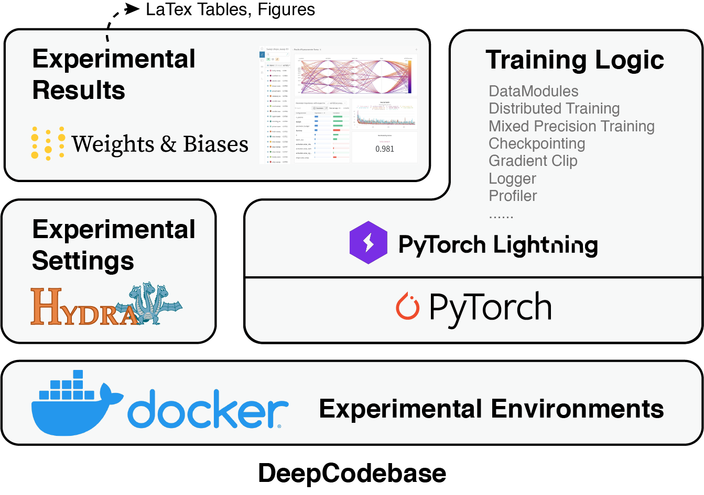

# Development Guides

## Introduction

**DeepCodebase** is a codebase/template for deep learning researchers, so that
**do experiments and releasing codes become easier**.


For deep learning researchers, a codebase is an experiment platform.
However, constructing a codebase from scratch costs many times and effort. As
for me, it makes me struggle to figure out many problems in the last few years.
For example,
>- how to organize the codes to make the project looks clean,
>- how to make codes more readable,
>- how to uniform the code style with collaborators,
>- how to manage the experimental environments so that moving to new machines is
>not painful,
>- how to manage the experimental settings so that experiments are reproducible,
>- how to record the results of experiments in detail but organized,
>- how to directly generate LaTex tables from experimental results with scripts,
>- how to test many deep learning technologies easily, such as distributed
>training, mix precision training, hyperparameter searching, profiling, etc.,
>- how to write a nice and clear README.md so that people would like to star my repo,
>- how should I choose a license for my project,
>- ......

And this codebase is a product of solving these problems. **If this codebase
inspires you or helps you to solve some problems, please give my repo a star. :)**


## A Walkthrough of DeepCodebase


The whole project is actually a collection of **tools** and **best practices**.
In other words, **do right things with suitable tools**.

The major **tools** used in the project include:
- [**Docker:**](https://www.docker.com/) the tool to manage the experimental environments.
- [**PyTorch:**](https://pytorch.org/) most common used machine / deep learning framework.
- [**PyTorch Lightning:**](https://pytorchlightning.ai/) the tool to access many advanced training technologies,
- [**Hydra:**](https://www.hydra.cc/) the tool to manage the experimental settings.
just like glue or a connector.
- [**Weights & Biases (wandb):**](https://www.wandb.ai/) the tool to record the results of experiments.

A figure to show the relationship between these tools:




**Best practices** are not easily described with a few words, they are fused into the
project structure and daily coding habits. Major actions include:
- Follow the folder structure to organize the code.
- Install `pre-commit` and let it format codes automatically after running `git commit`.
- Record your major code changes in [`CHANGELOG.md`](./CHANGELOG.md).
- Record important running scripts under the `scripts` folder, e.g. preprocess and training scripts.
- Write docstrings for your codes.
- Record newly installed python packages in `docker/requirements.txt`.

In the remaining sections, we will introduce the codebase in detail. The content
is structured as follows:

- [Commonly Used Commands](#commonly-used-commands)
- [Project Structure](#project-structure)
- [Docker - Prepare the Environment](#docker---prepare-the-environment)
- [PyTorch & PyTorch Lightning](#pytorch--pytorch-lightning)
- [Hydra - Configuration](#hydra---configuration)
- [Weights & Biases (wandb)](#weights--biases-wandb)
- [Other Best Practices*](#other-best-practices)
- [API Document*](#api-document)
- [Choose A License*](#choose-a-license)

Sections marked with * are bonus sections, read as your interests.
The first two sections are used for quick start/references
and the remaining sections explain them in detail.


### Commonly Used Commands

Commonly used commands in the codebase are listed below.

**If you don't want to read the document and just want to try it right now,
run commands marked with * to go through the whole workflow.**

```sh
# Environment
# * install docker-compose
pip install docker-compose
# * create the container after force rebuilding the image
python docker.py prepare --build
# * enter into the docker container
python docker.py
# stop the container
python docker.py stop
# restart the container
python docker.py restart

# Training
# * train the model
python train.py experiment=mnist_lenet
# train the model on a specific GPU
python train.py experiment=mnist_lenet pl_trainer.devices="[3]"
# change the experiment name (affects logging.wandb.name)
python train.py experiment=mnist_lenet name="lenet test"
# train the model on CPUs with 4 threads
python train.py experiment=mnist_lenet pl_trainer.accelerator=cpu pl_trainer.devices=4

# Debugging
# default debugging, num workers=0
python train.py experiment=mnist_lenet debug=default
# overfit the model
python train.py experiment=mnist_lenet debug=overfit

# Testing
# * test the model, <logdir> has been printed twice (start & end) when training
python test.py <logdir>
# test the model, with multiple config overrides, e.g.: to test multiple datasets
python test.py <logdir> --update_func test_original test_example
# update wandb, and prefix the metrics
python test.py --update_func test_original test_example --prefix original example --update_wandb

# * generate LaTex Tables
python scripts/generate_latex_table.py

# Unit Testing
# * test all cases
pytest
# test a specific case
pytest tests/test_conf.py
# let print functions print
pytest -s

# Pre-Commit
# * install hooks according to `.pre-commit-config.yaml`
pre-commit install
# * run pre-commit hooks on all files
pre-commit run -a
```

### Project Structure

The directory structure of this project is shown below.

```
├── conf                    <- Hydra configuration files
│   ├── callbacks               <- Callbacks configs
│   ├── criterion               <- Criterion configs
│   ├── dataset                 <- Dataset configs
│   ├── debug                   <- Debugging configs
│   ├── experiment              <- Experiment configs
│   ├── local                   <- Local configs
│   ├── logdir                  <- Logging directory configs
│   ├── logging                 <- Logger configs
│   ├── model                   <- Model configs
│   ├── optim                   <- Optimizer configs
│   ├── pipeline                <- Pipeline configs
│   ├── pl_trainer              <- Trainer configs
│   ├── scheduler               <- Scheduler configs
│   │
│   └── train.yaml              <- Main config for training
│
├── data                    <- Default project data folder, will be mounted to /data in the docker container
│
├── docker                  <- Dockerfiles
│   ├── Dockerfile              <- Dockerfile for building the docker image FROM a pre-built image
│   ├── Dockerfile.full         <- Dockerfile for building the docker image FROM official cuda image
│   ├── misc                    <- Miscellaneous files for building the docker image
│   └── requirements.txt        <- File for installing python dependencies
│
├── docs                    <- Documentation
│
├── log                     <- Default log folder, will be mounted to /log in the docker container
│
├── notebooks               <- Jupyter notebooks. Naming convention is a number (for ordering),
│                                  a short `-` delimited description, e.g. `1.0-preprocessing.ipynb`.
│
├── scripts                 <- Shell scripts. It is recommended to save your commands for preprocessing,
│                                  training in scripts.
│
├── src                     <- Source code
│   ├── criterion               <- Criterion modules, model outputs and targets in, loss and metrics out.
│   ├── dataset                 <- Datasets and Lightning datamodules
│   ├── model                   <- Models
│   ├── pipeline                <- Lightning modules, pipeline for training and testing
│   └── utils                   <- Utility scripts
│
├── tests                   <- Tests of any kind
│
├── docker-compose.yml          <- Docker-compose file for building the docker image
├── docker.py                   <- Run docker
│
├── test.py                     <- Run testing
├── train.py                    <- Run training
│
├── .env                        <- Automatically created by docker.py. Can also be used to store private environment variables
├── .pre-commit-config.yaml     <- Configuration of pre-commit hooks for code formatting
├── setup.cfg                   <- Configuration of linters and pytest
├── CHANGELOG.md                <- Changelog, TODO list, notes, and changes of the code.
├── DEVELOPMENT.md              <- Introduction of this template, how to use it, and some best practices.
├── LICENSE                     <- License of the project.
└── README.md                   <- Description of the project. A ready to use template for releasing your project.
```


### Docker - Prepare the Environment

Don't be worried if you don't know much about Docker.
Follow the steps below and the experimental environments will be ready for you.

**Step 1.** Install docker-compose in your workspace.
```sh
# (optional) set PyPI mirror
pip config set global.index-url https://pypi.tuna.tsinghua.edu.cn/simple
# install docker-compose
pip install docker-compose
```

**Step 2.** Build a docker image and start a docker container.
```sh
python docker.py prepare --build
```

**Step 3.** Enter the docker container at any time, start training models right now.
```sh
python docker.py [enter]
# train models
python train.py
```

More advanced scenarios:

**Q: How to add extra python packages to the container?**

The best practice is to use `pip install <package>` first when testing your codes.
After the testing, the environment should become stable. Add these packages to
[`docker/requirements.txt`](./docker/requirements.txt) and rebuild the docker image:
```sh
python docker.py prepare --build
```
This makes sure your environment can be reproduced by other people at any time.


**Q: What do I have in the built docker image?**

**A:** The image is built corresponding to [`docker/Dockerfile`](docker/Dockerfile).
To reduce the building time, the first several parts of the
[full Dockerfile](docker/Dockerfile.full) are pre-built into `deepbase/project:codebase`.


**Q: Docker or nvidia-docker are not installed on my host machine?**

**A:** You should contact the system administrator to install them. If you have
the root privilege, [follow this script](https://github.com/hughplay/memo/blob/9448664177709aed5e3614fdcba9413366a832fe/scripts/prepare_dl.sh#L163) to install them.


### PyTorch & PyTorch Lightning

PyTorch is the most popular deep learning framework in the research community of AI.
PyTorch Lightning is a wrapper of PyTorch to make it easier to use.
With PyTorch Lightning, you don't need to write a Trainer by yourself and only
need to focus on your data and model. Many features such as distributed training,
checkpointing, mixed precision training, gradient clipping can be applied just
by setting the arguments of the `Trainer`.

The typical workflow with PyTorch Lightning is described as follows (`pytorch_lightning` is noted as `pl`):
1. Write a `torch.Dataset`. In this example code, we directly use `torchvision.datasets.MNIST`.
2. [Write a `pl.LightningDataModule`](./src/dataset/mnist.py) to wrap the
`torch.Dataset`, which declares `torch.DataLoader`s in training, validation, and testing.
3. [Write a `pl.LightningModule`](./src/pipeline/classification.py),
called as "pipeline" in this template, which defines the logic of the training,
including what to do on training, validation, and testing steps. Specifically,
catching data from batches into model, calculating the loss and metrics,
and decide which metrics should be logged.
4. Finally, [set suitable arguments](./conf/pl_trainer/default.yaml) for `pl.Trainer`
to tell how would you like to train the model, such as how many gpus you would like
to use, etc.
5. Run the Trainer.

The final code in [`tran.py`](./train.py) becomes very simple:

```py
@hydra.main(config_path="conf", config_name="train")
def main(cfg: DictConfig) -> None:

    # Assign hydra.run.dir=<previous_log_dir> to resume training.
    # If previous checkpoints are detected, `cfg` will be replaced with the
    # previous config
    cfg = try_resume(cfg)

    # Print & save config to logdir
    print_config(cfg, save_path="config.yaml")

    # Set random seed
    if cfg.seed is not None:
        pl.seed_everything(cfg.seed)

    # Initialize datamodule
    datamodule = instantiate(cfg.dataset)

    # Initialize pipeline
    pipeline = instantiate(cfg.pipeline, cfg=cfg, _recursive_=False)

    # Initialize trainer
    cfg_trainer = prepare_trainer_config(cfg)
    trainer = pl.Trainer(**cfg_trainer)

    # Training
    if cfg.resume_ckpt is not None:
        logger.info(f"resume from {cfg.resume_ckpt}")
    trainer.fit(pipeline, datamodule, ckpt_path=cfg.resume_ckpt)

    # Testing
    if cfg.run_test:
        trainer.test(pipeline, datamodule, ckpt_path="best")
```

### Hydra - Configuration

You must have noticed in the last section, that there is a decorator above the `main`
function: `@hydra.main(config_path="conf", config_name="train")`. That is Hydra.

The duty of [Hydra](https://hydra.cc/docs/intro/) is to dynamically create a
hierarchical configuration by composition and override it through config files
and the command line. It composes the configuration from the conf folder into a
`DictConfig` object. And a `DictConfig` can be seen as a more powerful `dict`,
which comes from [OmegaConf](https://omegaconf.readthedocs.io/).

You don't really need to spend time reading documents of Hydra and OmegaConf
but to know the following grammer and tips:

1. *The entry point (main) of the configuration is `<config_path>/<config_name>.yaml`,
which is [`conf/train.yaml`](./conf/train.yaml) here. This file tells Hydra how
to construct the final configuration.
2. *`defaults` is just like `import` in Python. Each item below the `defaults` is
represented as `<key>: <value>`, which means the configuration under
`<config_path>/<key>/<value>.yaml` will be merged into main config,
under the `<key>`. For example, `dataset/mnist` means `conf/dataset/mnist.yaml` will be merged.
3. *Arguments can be overridden from the command line simply. For example, we want
to assign a model training on gpu 3, just run `python train.py pl_trainer.devices='[3]'`
(Note `devices=3` means using 3 gpus to train). And the `pl_trainer.devices` in the final
configuration will be overridden.
4. *Hydra provides a convenient way to instantiate objects.
Set the key [`_target_`](./conf/dataset/mnist.yaml) with a full import class name,
and `instantiate` this configuration node will
[instantiate you a corresponding object](./train.py) with given arguments.
For example, `src.dataset.mnist.MNISTDataModule`.

Other tips may be useful when you start to use Hydra and have some special requirements:

5. Hydra (actually OmegaConf) could resolve variables in the configuration like
[f-strings in python](https://docs.python.org/3/tutorial/inputoutput.html#fancier-output-formatting).
For example, the value `${dataset._target_}` will be replaced by the actual value of
the `dataset._target_`. It can also resolve environment variables with
[built-in resolvers](https://omegaconf.readthedocs.io/en/2.2_branch/custom_resolvers.html#built-in-resolvers),
such as `now` provide the timestamp of launching scripts.
Variables in `.env` are injected as environment variables by `pydotenv` in this project,
so you can access them like `${oc.env:<key>}`.
You can also register [your own resolver](./src/utils/exptool.py) to implement
some manipulation on the config values. In this example, we use a `tail` resolver
to only keep the last part of the `_target`
value for [`exp_id` in `train.yaml`](./conf/train.yaml).
6. In #2, `<config_path>/<key>/<value>.yaml` will not be merged under the `<key>`
but the root of the main config, if there is a `# @package _global_` in the first
line of the file. This is how [`experiments`](./conf/experiment/mnist_lenet.yaml)
override the main config and becomes the snapshots of our experiments.
7. In a config file with `# @package _global_`,
you can [override `defaults`](./conf/experiment/mnist_dnn.yaml) by
setting `- override /<key>: value` under defaults.
For example, `- override /model: dnn` will override the `model` as `dnn`.


**Best practice: Be careful to change the default settings, just override them with experiments**.


### Weights & Biases (wandb)

Wandb is a great tool for experiment tracking. I never use TensorBoard again
after my first try. It also provides API, so that transforming your experimental
results into LaTex tables with scripts becomes simple.
Pytorch Lightning has already provided a `pytorch_lightning.loggers.WandbLogger`,
and this codebase enables this logger by default.

The only things you need to do:
1. [Register a wandb account](https://wandb.ai/).
2. Decide what to log in the [pipeline](./src/pipeline/classification.py) by
calling `self.log()`.
3. When you first launch an experiment with wandb, it will prompt you to
authorize your account, just do what the prompting says with a few clicks.

**How to generate a LaTex table from wandb results?**

An example is ready for you in [`scripts/gen_latex_table.py`](scripts/gen_latex_table.py).
Run `python scripts/gen_latex_table.py` after you have trained some models logged with wandb.
The output looks like this:

```latex
\usepackage{booktabs}

\begin{table}[ht]
\centering
\caption{Model accuracy on MNIST}
\begin{tabular}{lr}
\toprule
Model & Accuracy \\
\midrule
DNN & 0.974200 \\
LeNet & \textbf{0.983000} \\
\bottomrule
\end{tabular}
\end{table}
```

### Other Best Practices*

**Changelog**

It is a good habit to [record the changes](./CHANGELOG.md) in the codes for
later checking and sharing.


**Pre-Commit**

This tool is learned from [lightning-hydra-template](https://github.com/ashleve/lightning-hydra-template),
it is very useful for uniforming code styles when collaborating.
The codes become clean after using this tool. If you want to try it, just run:
```sh
# 1. install pre-commit:
pip install pre-commit
# 2. install git hook scripts, and pre-commit will run automatically on git commit:
pre-commit install
# 3. (optional) run against all the files
pre-commit run -a
```
After `pre-commit` is installed, it will run automatically after you commit your code.
If `pre-commit` changes your code, don't forget to git add & commit again.
Running hooks are configured in [`.pre-commit-config.yaml`](./.pre-commit-config.yaml).

**Code Style**

This codebase prefer `--max-line-length=80` for python language. You can modify
this setting in [setup.cfg](./setup.cfg) as you like.


**PyTest**

Write some test cases to make sure codes run as you expect.
There are two example tests under `tests/`. Try to test with:

```sh
# * test all cases
pytest
# test a specific case
pytest tests/test_conf.py
# let print functions print
pytest -s
```


### API Document*

This codebase supports automatically generating API documents from python modules
with [sphinx](https://www.sphinx-doc.org/):

``` sh
# install sphinx dependencies
./scripts/doc_setup.sh

# serve the documentation
./scripts/doc_serve.sh
```
When documents are built, they can be viewed at [http://localhost:8080](http://localhost:8080)

The style of the docstring is followed
[numpy style docstring](https://numpydoc.readthedocs.io/en/latest/format.html#docstring-standard).


### Choose A License*

This codebase is under [MIT license](./LICENSE).
Don't forget to modify the year and the name in the license when releasing your own projects.
In most cases, MIT License is suitable.
You could also [follow this guide to choose a different license](https://choosealicense.com/).
